# OpenTelemetry Astronomy Shop - Architecture Diagram

## High-Level Architecture

```mermaid
flowchart TB
    subgraph Users["External Users"]
        Browser["Browser/Mobile"]
        LoadGen["Load Generator<br/>(Locust/Python)"]
    end

    subgraph Proxy["Entry Point"]
        FrontendProxy["Frontend Proxy<br/>(Envoy)"]
    end

    subgraph Frontend["Frontend Layer"]
        FrontendApp["Frontend<br/>(Next.js/TypeScript)"]
        ImageProvider["Image Provider<br/>(Nginx)"]
    end

    subgraph BusinessServices["Core Business Services"]
        subgraph Shopping["Shopping Flow"]
            Cart["Cart<br/>(C#/.NET)"]
            Checkout["Checkout<br/>(Go)"]
            Payment["Payment<br/>(Node.js)"]
            Shipping["Shipping<br/>(Rust)"]
            Quote["Quote<br/>(PHP)"]
        end

        subgraph Catalog["Product Services"]
            ProductCatalog["Product Catalog<br/>(Go)"]
            ProductReviews["Product Reviews<br/>(Python)"]
            Recommendation["Recommendation<br/>(Python)"]
        end

        subgraph Marketing["Marketing Services"]
            Ad["Ad Service<br/>(Java)"]
        end

        subgraph Notifications["Notification Services"]
            Email["Email<br/>(Ruby)"]
        end

        subgraph Finance["Finance Services"]
            Accounting["Accounting<br/>(C#/.NET)"]
            FraudDetection["Fraud Detection<br/>(Kotlin)"]
        end

        subgraph AI["AI Services"]
            LLM["LLM<br/>(Python Mock)"]
        end

        subgraph Currency["Currency Services"]
            CurrencyService["Currency<br/>(C++)"]
        end
    end

    subgraph DataStores["Data Stores"]
        Valkey["Valkey<br/>(Redis-compatible)"]
        PostgreSQL["PostgreSQL"]
        Kafka["Kafka"]
    end

    subgraph FeatureFlags["Feature Flags"]
        Flagd["Flagd"]
        FlagdUI["Flagd UI<br/>(Elixir/Phoenix)"]
    end

    subgraph Observability["Observability Stack"]
        OTelCollector["OpenTelemetry<br/>Collector"]
        Jaeger["Jaeger<br/>(Tracing)"]
        Prometheus["Prometheus<br/>(Metrics)"]
        Grafana["Grafana<br/>(Dashboards)"]
        OpenSearch["OpenSearch<br/>(Logs)"]
    end

    %% User connections
    Browser --> FrontendProxy
    LoadGen --> FrontendProxy

    %% Proxy routing
    FrontendProxy --> FrontendApp
    FrontendProxy --> Jaeger
    FrontendProxy --> Grafana
    FrontendProxy --> FlagdUI
    FrontendProxy --> LoadGen
    FrontendProxy --> ImageProvider

    %% Frontend to services
    FrontendApp --> Cart
    FrontendApp --> Checkout
    FrontendApp --> CurrencyService
    FrontendApp --> ProductCatalog
    FrontendApp --> ProductReviews
    FrontendApp --> Recommendation
    FrontendApp --> Shipping
    FrontendApp --> Ad

    %% Checkout flow
    Checkout --> Cart
    Checkout --> CurrencyService
    Checkout --> Email
    Checkout --> Payment
    Checkout --> ProductCatalog
    Checkout --> Shipping

    %% Shipping to Quote
    Shipping --> Quote

    %% Recommendation to catalog
    Recommendation --> ProductCatalog

    %% Product Reviews dependencies
    ProductReviews --> ProductCatalog
    ProductReviews --> LLM

    %% Checkout publishes to Kafka
    Checkout --> Kafka

    %% Kafka consumers
    Kafka --> Accounting
    Kafka --> FraudDetection

    %% Data store connections
    Cart --> Valkey
    ProductCatalog --> PostgreSQL
    ProductReviews --> PostgreSQL
    Accounting --> PostgreSQL

    %% Feature flag connections (dashed)
    Ad -.-> Flagd
    Cart -.-> Flagd
    Checkout -.-> Flagd
    Email -.-> Flagd
    FrontendApp -.-> Flagd
    LoadGen -.-> Flagd
    Payment -.-> Flagd
    ProductCatalog -.-> Flagd
    ProductReviews -.-> Flagd
    Recommendation -.-> Flagd
    LLM -.-> Flagd
    FraudDetection -.-> Flagd

    %% Telemetry connections (dotted)
    Cart -.-> OTelCollector
    Checkout -.-> OTelCollector
    CurrencyService -.-> OTelCollector
    Email -.-> OTelCollector
    FrontendApp -.-> OTelCollector
    Payment -.-> OTelCollector
    ProductCatalog -.-> OTelCollector
    ProductReviews -.-> OTelCollector
    Quote -.-> OTelCollector
    Recommendation -.-> OTelCollector
    Shipping -.-> OTelCollector
    Ad -.-> OTelCollector
    Accounting -.-> OTelCollector
    FraudDetection -.-> OTelCollector
    ImageProvider -.-> OTelCollector
    Kafka -.-> OTelCollector
    Flagd -.-> OTelCollector
    FlagdUI -.-> OTelCollector

    %% Collector to backends
    OTelCollector --> Jaeger
    OTelCollector --> Prometheus
    OTelCollector --> OpenSearch
    Prometheus --> Grafana
    OpenSearch --> Grafana
    Jaeger --> Grafana

    %% Styling
    classDef frontend fill:#4CAF50,stroke:#2E7D32,color:white
    classDef business fill:#2196F3,stroke:#1565C0,color:white
    classDef data fill:#FF9800,stroke:#EF6C00,color:white
    classDef telemetry fill:#9C27B0,stroke:#6A1B9A,color:white
    classDef external fill:#607D8B,stroke:#37474F,color:white
    classDef flags fill:#00BCD4,stroke:#00838F,color:white

    class FrontendApp,ImageProvider frontend
    class Cart,Checkout,Payment,Shipping,Quote,ProductCatalog,ProductReviews,Recommendation,Ad,Email,Accounting,FraudDetection,LLM,CurrencyService business
    class Valkey,PostgreSQL,Kafka data
    class OTelCollector,Jaeger,Prometheus,Grafana,OpenSearch telemetry
    class Browser,LoadGen external
    class Flagd,FlagdUI flags
```

## Service Details

| Service | Language | Port | Description |
|---------|----------|------|-------------|
| **Frontend** | TypeScript/Next.js | 8080 | Web UI for the astronomy shop |
| **Frontend Proxy** | Envoy | 8080 | API gateway and reverse proxy |
| **Cart** | C# (.NET) | 7070 | Shopping cart management |
| **Checkout** | Go | 5050 | Order orchestration |
| **Currency** | C++ | 7001 | Currency conversion |
| **Email** | Ruby | 6060 | Order confirmation emails |
| **Payment** | Node.js | 50051 | Payment processing |
| **Product Catalog** | Go | 3550 | Product listing and search |
| **Product Reviews** | Python | 3551 | Reviews and AI assistant |
| **Quote** | PHP | 8090 | Shipping quotes |
| **Recommendation** | Python | 9001 | Product recommendations |
| **Shipping** | Rust | 50050 | Shipping cost and fulfillment |
| **Ad** | Java | 9555 | Contextual advertisements |
| **Accounting** | C# (.NET) | - | Financial accounting (Kafka consumer) |
| **Fraud Detection** | Kotlin | - | Fraud analysis (Kafka consumer) |
| **LLM** | Python | 8000 | Mock LLM for AI features |
| **Image Provider** | Nginx | 8081 | Product image serving |

## Data Flow

### Shopping Flow
1. User browses products via **Frontend** → **Product Catalog**
2. User adds items to cart via **Frontend** → **Cart** → **Valkey**
3. User gets recommendations via **Frontend** → **Recommendation** → **Product Catalog**
4. User checks out via **Frontend** → **Checkout**:
   - Retrieves cart from **Cart**
   - Gets product info from **Product Catalog**
   - Converts currency via **Currency**
   - Calculates shipping via **Shipping** → **Quote**
   - Processes payment via **Payment**
   - Sends confirmation via **Email**
   - Publishes order event to **Kafka**

### Async Processing
- **Checkout** publishes order events to **Kafka**
- **Accounting** consumes events for financial records → **PostgreSQL**
- **Fraud Detection** consumes events for fraud analysis

### Observability Flow
- All services export telemetry (traces, metrics, logs) to **OTel Collector**
- **OTel Collector** routes data to:
  - **Jaeger** for distributed tracing
  - **Prometheus** for metrics
  - **OpenSearch** for logs
- **Grafana** provides unified dashboards

## Technology Stack

| Category | Technologies |
|----------|--------------|
| **Languages** | TypeScript, Go, Python, Java, C#, Ruby, Rust, C++, PHP, Kotlin |
| **Frameworks** | Next.js, ASP.NET, gRPC, Locust |
| **Databases** | PostgreSQL, Valkey (Redis) |
| **Messaging** | Apache Kafka |
| **Observability** | OpenTelemetry, Jaeger, Prometheus, Grafana, OpenSearch |
| **Infrastructure** | Docker, Envoy Proxy |
| **Feature Flags** | Flagd (OpenFeature) |
