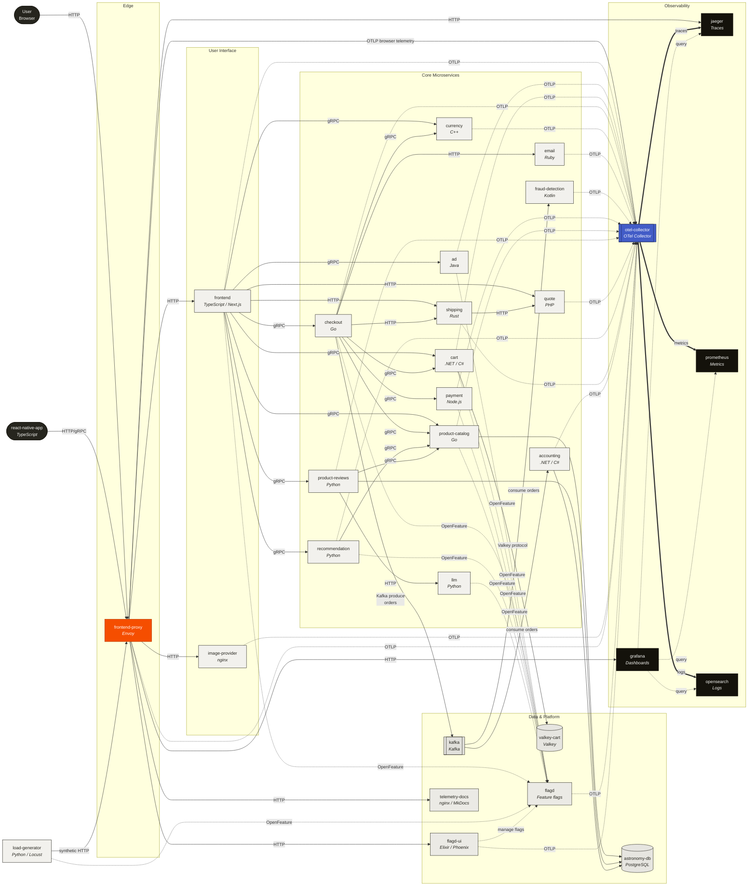

<!-- markdownlint-disable MD013 MD033 -->
# OpenTelemetry Demo — Architecture Diagram

The OpenTelemetry Demo ("Astronomy Shop") is a polyglot microservice
application used to exercise and showcase OpenTelemetry instrumentation. The
diagram below shows the runtime topology as defined in
[`docker-compose.yml`](../docker-compose.yml): user traffic enters through the
Envoy-based `frontend-proxy`, fans out across the service mesh, and every
service exports traces / metrics / logs to the OpenTelemetry Collector, which
then forwards signals to the observability back-ends (Jaeger, Prometheus,
OpenSearch, Grafana).

Each service node is annotated with its implementation language. Solid edges
represent service-to-service request traffic (gRPC / HTTP / Kafka). Dashed
edges represent telemetry (OTLP) emitted to the Collector. Dotted edges
represent Collector exports to observability back-ends.

## Rendered diagrams

The Mermaid source below is the canonical description of the architecture.
Pre-rendered copies live alongside it:

- [`architecture.svg`](./architecture.svg)
- [`architecture.png`](./architecture.png)

## Mermaid source

## Legend

- **Solid edges** — in-band request traffic (gRPC, HTTP, Kafka).
- **Dashed edges (`-.->`)** — OpenTelemetry (OTLP) telemetry export or
  OpenFeature flag evaluations.
- **Thick edges (`==>`)** — Collector exporting signals to a back-end.
- **Orange node** — Envoy edge proxy (`frontend-proxy`).
- **Blue node** — OpenTelemetry Collector (telemetry hub).
- **Dark nodes** — end-user actors and observability back-ends.

## Service inventory

| Service             | Language / runtime     | Role                                            |
|---------------------|------------------------|-------------------------------------------------|
| `frontend-proxy`    | Envoy                  | Edge router; terminates public traffic          |
| `frontend`          | TypeScript / Next.js   | Astronomy Shop web UI + BFF                     |
| `react-native-app`  | TypeScript             | Mobile client (not started by compose)          |
| `image-provider`    | nginx                  | Serves product images                           |
| `ad`                | Java                   | Ad recommendations (gRPC)                       |
| `cart`              | .NET / C#              | Shopping cart (gRPC), backed by Valkey          |
| `checkout`          | Go                     | Checkout orchestration (gRPC)                   |
| `currency`          | C++                    | FX conversion (gRPC)                            |
| `email`             | Ruby                   | Order confirmation emails (HTTP)                |
| `fraud-detection`   | Kotlin                 | Kafka consumer scoring orders                   |
| `payment`           | Node.js                | Payment processing (gRPC)                       |
| `product-catalog`   | Go                     | Product data (gRPC), backed by PostgreSQL       |
| `product-reviews`   | Python                 | Reviews (gRPC), backed by PostgreSQL + LLM      |
| `quote`             | PHP                    | Shipping quotes (HTTP)                          |
| `recommendation`    | Python                 | Recommendation engine (gRPC)                    |
| `shipping`          | Rust                   | Shipping (HTTP + gRPC)                          |
| `accounting`        | .NET / C#              | Kafka consumer recording orders                 |
| `llm`               | Python                 | LLM-backed review summarization                 |
| `flagd`             | OpenFeature flagd      | Feature-flag evaluation                         |
| `flagd-ui`          | Elixir / Phoenix       | UI for flagd flag management                    |
| `kafka`             | Apache Kafka           | Event bus between checkout / accounting / fraud |
| `valkey-cart`       | Valkey                 | Cache for cart contents                         |
| `astronomy-db`      | PostgreSQL             | Shared OLTP database                            |
| `otel-collector`    | OpenTelemetry Collector| Receives OTLP; fans out to back-ends            |
| `jaeger`            | Jaeger                 | Trace storage / UI                              |
| `prometheus`        | Prometheus             | Metric storage                                  |
| `opensearch`        | OpenSearch             | Log storage                                     |
| `grafana`           | Grafana                | Unified dashboarding over the three back-ends   |
| `load-generator`    | Python / Locust        | Drives synthetic traffic                        |
| `telemetry-docs`    | nginx / MkDocs         | Hosts demo's telemetry docs                     |

## Source of truth

This diagram is derived from:

- Top-level [`docker-compose.yml`](../docker-compose.yml) service graph and
  `depends_on` relationships.
- Per-service `*_ADDR` / `*_HOST` wiring in [`.env`](../.env).
- Service README files under [`src/`](../src) describing language, protocol
  and collaborators.
