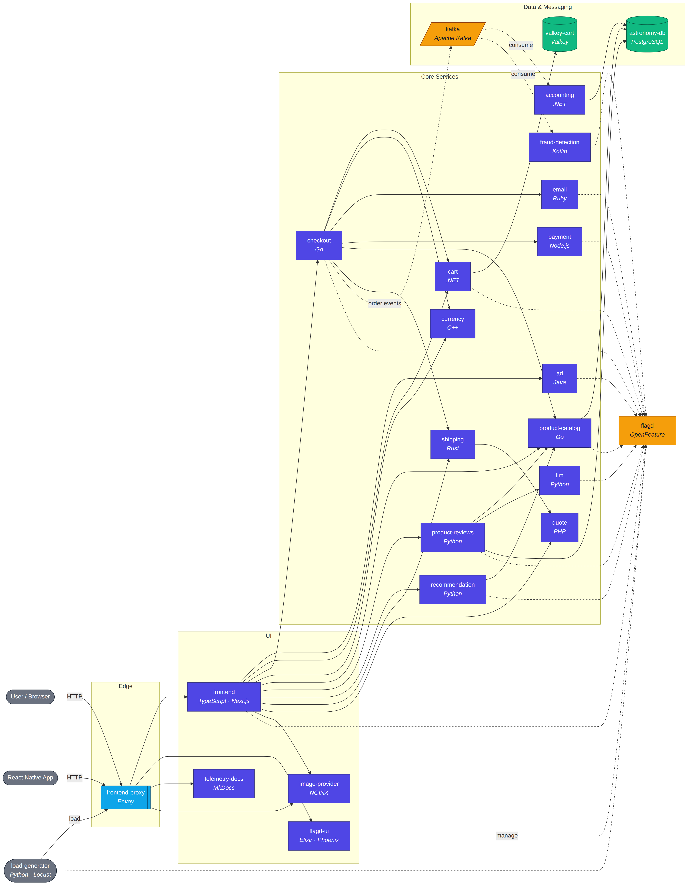
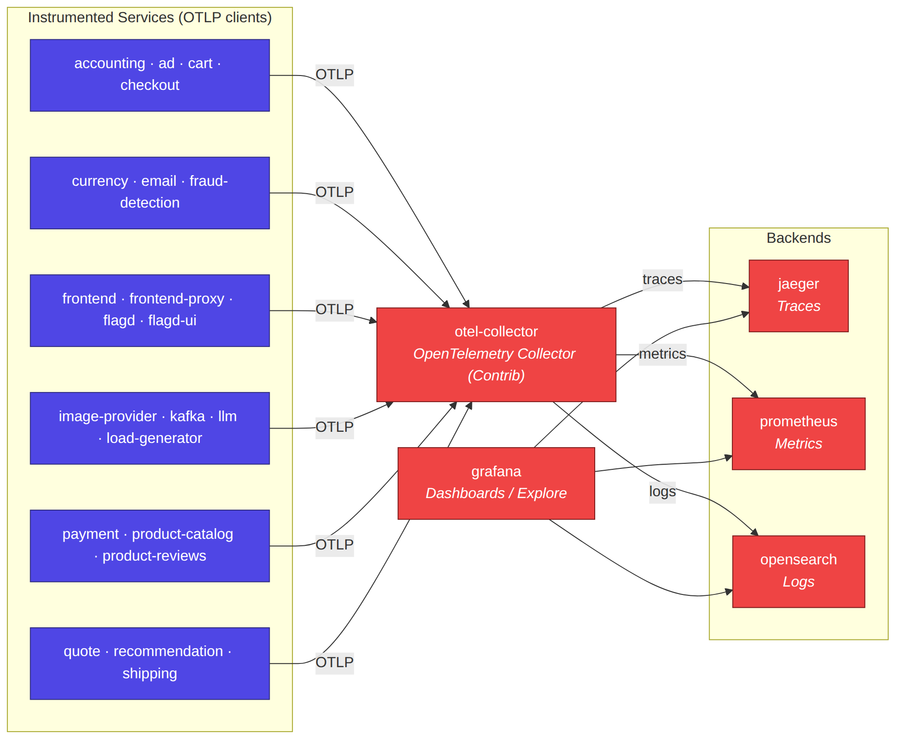

# Architecture Diagrams

This folder contains architecture diagrams for the OpenTelemetry Astronomy
Shop demo. Diagrams are authored in [Mermaid](https://mermaid.js.org/) and
rendered to SVG and PNG.

## Diagrams

| File | Description |
| --- | --- |
| [`services.mmd`](./services.mmd) | Service topology: user traffic, edge proxy, service-to-service calls, datastores, Kafka messaging, and feature-flag evaluation. |
| [`telemetry.mmd`](./telemetry.mmd) | Telemetry pipeline: OTLP flow from instrumented services through the OpenTelemetry Collector to Jaeger, Prometheus, OpenSearch, and Grafana. |
| [`architecture.mmd`](./architecture.mmd) | Combined view of the two diagrams above. Denser — useful for a single-image overview. |

Pre-rendered images are checked in alongside each source file
(`*.svg` and `*.png`).

## Rendering

The diagrams are plain Mermaid and can be viewed directly on GitHub or in any
Mermaid-aware renderer. To regenerate the images locally:

```bash
# Requires Node.js and a local Chrome/Chromium installation
PUPPETEER_SKIP_DOWNLOAD=true npm install -g @mermaid-js/mermaid-cli

cd docs/architecture
for f in services telemetry architecture; do
  mmdc -i "$f.mmd" -o "$f.svg" -b white --width 2400
  mmdc -i "$f.mmd" -o "$f.png" -b white --width 2800 --scale 2
done
```

## Service Topology



**Edge.** The `frontend-proxy` (Envoy) is the single ingress for all user
traffic (browser, React Native app, and the Locust `load-generator`). It routes
to the Next.js `frontend`, the `flagd-ui`, `telemetry-docs`, `image-provider`,
and the observability UIs (Grafana, Jaeger).

**Core services.** The `frontend` fans out to most backend services
(`ad`, `cart`, `checkout`, `currency`, `product-catalog`, `product-reviews`,
`recommendation`, `shipping`, `quote`, `image-provider`). `checkout` is the
main orchestrator at purchase time — it calls `cart`, `currency`, `email`,
`payment`, `product-catalog`, and `shipping`, and publishes order events to
Kafka.

**Datastores.** `cart` uses Valkey (Redis-compatible). `product-catalog`,
`product-reviews`, and `accounting` share a PostgreSQL instance
(`astronomy-db`).

**Messaging.** Kafka carries order events from `checkout` to `accounting`
and `fraud-detection`.

**Feature flags.** All services (and the load generator) evaluate feature
flags through `flagd`, managed via `flagd-ui`.

## Telemetry Pipeline



Every service is instrumented with OpenTelemetry and exports OTLP traces,
metrics, and logs to the `otel-collector`. The Collector fans out to
- `jaeger` — traces,
- `prometheus` — metrics,
- `opensearch` — logs.

`grafana` reads from all three backends for dashboards and ad-hoc exploration.
